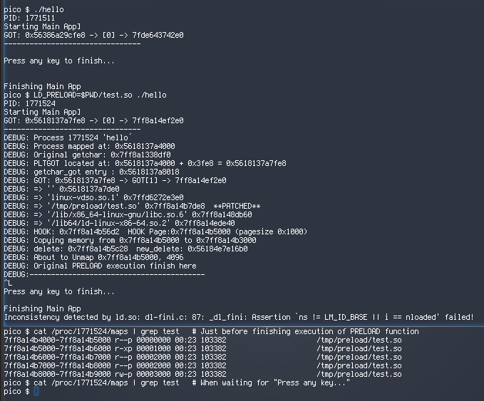

# Hiding `LD_PRELOAD` libraries

This repository contains code to hide libraries executed using the `LD_PRELOAD` environmental variable. The `LD_PRELOAD` variable allows a user to load a shared library before a program gets executed and therefore, that library can overwrite any function used by the program. 

This technique is usually used by user space rootkits and also for doing things like _proxyfying_ programs (by overwriting the `connect` function to establish the connections through a proxy transparently to the main app).

Anyhow, the process of running a dynamic binary is more or less  like this:

* The user runs a dynamic binary
* Kernel loads it and checks the `.interp` section to figure out which dynamic linker to use.
* Then, it loads the indicated dynamic linker (using the same function used to load the initial binary) and gives control to the dynamic linker to take care of the former binary.
* Before doing anything else, the dynamic linker will load the libraries indicated by the env variable `LD_PRELOAD` so they are first in the search sequence for dynamic symbols. This is how you can overwrite any function on the program.

Then the dynamic linker finish preparation for the execution: code relocation, library loading, etc.. getting everything ready to allow the execution and make the dynamic symbol resolution work.

At this point, all dynamic libraries, including the `LD_PRELOAD` ones are loaded in memory and the program `GOT` (_Global Offset Table_) and `PLT` (_Procedure Linkage Table_) is ready to be used for dynamic linking magic. 

The first three entries in the `PLT` (`.got.plt` section) are special and not used for the main program for function name resolution. Specially the second one is interesting for us because it is the so-called `link_map`, a linked list that contains all libraries required by the process.

With this background, let's see how to get rid of the original `LD_PRELOAD` library, so it won't show up at places like `/proc/PID/maps`.

Note that the goal here is not to overwrite functions on the program, but to inject code in a program coming from a library that won't show up in the process memory map.

# Technique

The preload library would hook a function used by the main program and, whenever the main program runs that function, the preloaded library will get the control.

Then the function would do whatever the attacker tries to achieve, and once it's done, the attacker wants the library/code to disappear. This can be done following the steps below:

* Figure out the main program address in case it is a PIE binary. We can do this parsing `/proc/self/maps`
* For the function being hooked, find the next instance in the available libraries (`dlsym RTLD_NEXT`)
* Find the PLT entry for the hooked function and patched with the next candidate found in previous step. This way, future calls to the hooked function won't crash the program.
* Get the main program `GOT` table to access the process `link_map`. Note that we need the main program `GOT` not our owns library `GOT`.
* Find the entry associated to the preload library
* Null the `l_ns` fields (`offset + 40`). This will prevent the dynamic linker to try to use our library in future symbol lookup by the main program. I believe we really need to patch `l_scope` but I'm having troubles finding the field
* Allocate memory to copy over whatever code the attacker needs to maintain once the function returns. Part of this code is the memory clean-up function that is mandatory to copy.
* Copy over the code/data required for later, as a minimum (as indicated above) the memory clean-up function).
* Recalculate code position for the memory clean-up code that needs to be call before leaving the function.
* Call the memory clean-up function. This is performed with a `jmp` instruction as we do not want to mess up the stack
* The memory clean-up function is now running on an anonymous memory block (no backed file associated) and can now unmap the original library memory blocks. We pass over the base segment. Current implementation just assume there will be 4 pages for the library... This may have to be updated or properly calculated by the library.

Then we just restore the frame pointer and return to the main program.

# Notes on the PoC

This is a Proof Of Concept. Some values have just been hardcoded for this specific example and the code, as is, may not work in the general case. Check the source code for specific comments.

The unmapping function was implemented in asm to simplify the copy over process and avoid to work out potential relocations.

There are one issue with the current implementation:

* There is an error when the main application finishes. As we set the `l_ns` field to `NULL` that fires an assertion at run-time when from `dl-fini` function. This may get fixed when parsing `l_scope` instead of `l_ns`.

Also note that I mess up with some fields in `link_map` that are internal and may change on future versions of the dynamic linker, and break the patching of `link_map`. For this development I used GlibC 2.36 you can see the `link_map` struct here:

https://elixir.bootlin.com/glibc/glibc-2.36/source/include/link.h#L95

If anybody makes it, please ping me! ;)

Thanks to: jeffy 0xcyb3rz3np4153c and 0xf00s 
